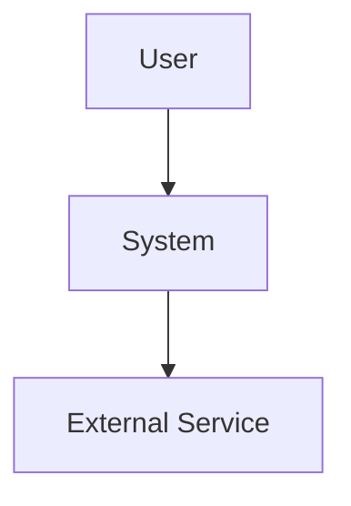
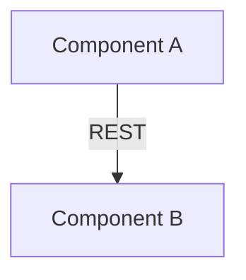
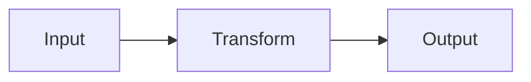
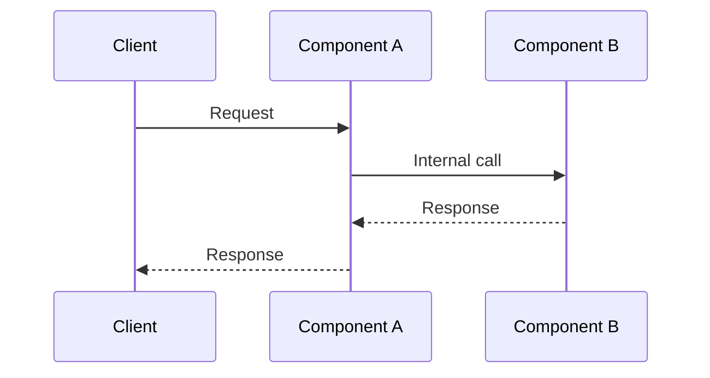

# ARCH-YYYYMMDD-NN: Architecture Title

Last modified: YYYY-MM-DD
Status: Active

## Purpose

<!-- State what this architecture document covers and its scope. -->

Related specifications:

- SPEC-YYYYMMDD-NN

Related decisions:

- DEC-YYYYMMDD-NN

## System context

<!-- Describe the system's environment: external actors, integration points,
system boundaries. -->

## Components

### Component A

- **Responsibility:** Description.
- **Public interfaces:** Interface description.
- **Dependencies:** Component B.
- **Technology:** Technology choice.

### Component B

- **Responsibility:** Description.
- **Public interfaces:** Interface description.
- **Dependencies:** None.
- **Technology:** Technology choice.

## Contracts

- CON-YYYYMMDD-NN: Contract between Component A and Component B.

## Data flow

<!-- Describe how data moves through the system. -->

## Control flow

<!-- Describe how control moves through the system for critical paths. -->

## Runtime topology

<!-- Describe the runtime deployment: process boundaries, deployment units,
communication protocols. -->

## Cross-cutting concerns

### Security

- Authentication: Description.
- Authorization: Description.

### Observability

- Logging: Description.
- Metrics: Description.
- Tracing: Description.

### Error handling

- Strategy: Description.
