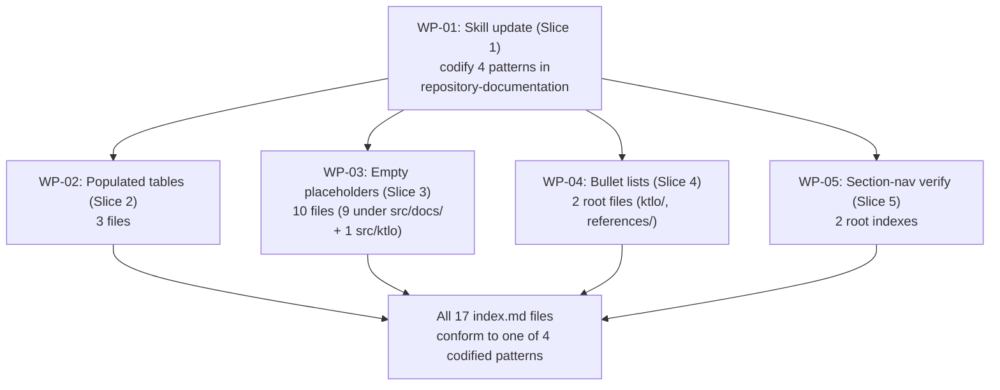

# PLAN-20260904-01: Standardize index.md structure across the repo

Last modified: 2026-09-04
Status: Ready

## Objective

Bring every `index.md` under consistent, self-describing patterns (relative-link
titles, codified row format, status/date columns where applicable) so that
navigating the repo does not require the reader to learn three different index
shapes. The rules for those patterns are codified in the
`repository-documentation` skill, and every existing `index.md` is brought into
conformance with that codification.

## Related specifications and decisions

This is a docs-housekeeping plan. No specification implements it and no
decision record constrains it. The behavior under change is the layout of
human-readable index files; the only normative artifact governing indexes today
is the `repository-documentation` skill itself, which this plan extends.

## Current-state findings

- 17 `index.md` files exist across the repo: 2 at `docs/` and `src/docs/` root
  (section-navigation pattern), 3 under `docs/` populated with tables
  (`specs/`, `plans/`, `decisions/`), 9 empty placeholders under `src/docs/`
  (every active and archive subdirectory), and 2 bullet-list files
  (`ktlo/index.md`, `references/index.md`); `src/ktlo/index.md` is an empty
  placeholder.
- Three patterns are in use today: tables, bullet lists, and empty
  placeholders. None of them is the codified rule a reader can derive from the
  `repository-documentation` skill.
- `src/ktlo/index.md` was recently edited to drop an incorrectly-dividing
  table; it is now an empty placeholder awaiting a pattern decision.
- The `repository-documentation` skill exists and prescribes link discipline
  and directory-link rules, but it does not codify index row/entry formats or
  the empty-placeholder convention.
- The current populated tables each diverge in a different way: `docs/specs/`
  has a `Slug | Title | Status` triple; `docs/plans/` has
  `Slug | Title | Readiness (0-10)` (an unscored prose field that does not
  match the plan lifecycle values); `docs/decisions/` has
  `# | Title | Status | Date` where the `#` column duplicates the filename and
  the `Slug` columns elsewhere duplicate the linked path.

## Intended shape

After this plan:

- The `repository-documentation` skill gains an "Index row formats" subsection
  that codifies four patterns — populated table, empty placeholder, bullet
  list, and section navigation — and fixes the canonical column order
  `Title | Description | Status | Date` with relative-link titles, no slug
  column, no numeric row index, and one standardized empty-placeholder shape.
- All 17 existing `index.md` files are converted to one of the four codified
  patterns. `docs-check.js` validates them after the sweep.
- The post-plan shape is uniform enough that a reader who learns the skill can
  predict the shape of any `index.md` they encounter without reading it.

## Work packages

### WP-01: Skill update (Slice 1)

**Description:** Update
`src/.opencode/skills/repository-documentation/SKILL.md` to add an "Index row
formats" subsection that codifies four patterns: populated table, empty
placeholder, bullet list, and section navigation. The subsection fixes the
canonical column order `Title | Description | Status | Date`, requires
relative-link titles (the linked text is the title), removes the `Slug`
column, removes the numeric `#` column, and defines the empty-placeholder
shape as an empty-table header plus one italicized row of the form
`_No <type> yet. Use the area's template to create one._` (or its
section-nav / bullet-list equivalents). All subsequent slices in this plan
work under the `repository-documentation` skill after this update lands; the
skill update therefore blocks WP-02..WP-05.

**Tasks:**

- T-01: Add "Index row formats" subsection to the
  `repository-documentation` skill with the four patterns, canonical column
  order, and empty-placeholder shape (Required).
- T-02: Produce a populated-table specimen (one rendered row) for human
  review against an existing spec / decision / plan (Required).
- T-03: Produce a bullet-list specimen (one rendered entry) for human review
  against an existing KTLO item and an existing reference note (Required).
- T-04: Produce an empty-placeholder specimen (one rendered file) for human
  review against an existing empty `src/docs/<area>/index.md` (Required).

**Dependencies:** None. Blocks WP-02, WP-03, WP-04, WP-05.

**Parallelism:** None — the four slices cannot start until WP-01 ships.

### WP-02: Populated tables (Slice 2)

**Description:** Reformat the three populated `index.md` files under `docs/`
(`specs/`, `plans/`, `decisions/`) to the canonical column order
`Title | Description | Status | Date`, drop the `Slug` and `#` columns, link
the title text (not a separate column), and pull the `Description` from each
linked file's Purpose/scope or first paragraph (≤40 tokens) and `Date` from
its `Last modified` line. Work happens under the `repository-documentation`
skill after the WP-01 update.

**Tasks:**

- T-05: Rewrite `docs/specs/index.md` to the canonical table format and add
  one row for `SPEC-20260903-01` (Required).
- T-06: Rewrite `docs/plans/index.md` to the canonical table format and add
  one row for `PLAN-20260903-01` (Required).
- T-07: Rewrite `docs/decisions/index.md` to the canonical table format and
  convert the existing `#` row into a title-link row for
  `DEC-20260829-01` (Required).

**Dependencies:** WP-01.

**Parallelism:** T-05, T-06, T-07 can run in parallel.

### WP-03: Empty placeholders (Slice 3)

**Description:** Convert the 10 empty-placeholder indexes (the 6 active
subdirectories under `src/docs/`, the 3 archive subdirectories under
`src/docs/` (`specs/archive`, `decisions/archive`, `plans/archive`), plus
`src/ktlo/index.md`) to the codified empty-placeholder shape: an empty-table
header in the canonical column order `Title | Description | Status | Date`
followed by one italicized single-row placeholder pointing at `template.md`.
Work happens under the `repository-documentation` skill after the WP-01
update.

**Tasks:**

- T-08: Convert all 10 empty-placeholder indexes to the codified
  empty-placeholder shape in one sweep, preserving each file's title, lead
  paragraph, and parent/child-directory sections. The 10 files are:
  `src/docs/specs/index.md`, `src/docs/plans/index.md`,
  `src/docs/decisions/index.md`, `src/docs/architecture/index.md`,
  `src/docs/contracts/index.md`, `src/docs/implementation-maps/index.md`,
  `src/docs/specs/archive/index.md`, `src/docs/decisions/archive/index.md`,
  `src/docs/plans/archive/index.md`, and `src/ktlo/index.md` (Required).
- T-09: Run `node .opencode/docs-check.js` and
  `npx --yes markdownlint-cli2@0.23.2` against the converted files to
  confirm no link or lint regressions (Required).

**Dependencies:** WP-01.

**Parallelism:** Can run in parallel with WP-02, WP-04, and WP-05.

### WP-04: Bullet lists (Slice 4)

**Description:** Standardize the two existing bullet-list `index.md` files
(`ktlo/index.md` and `references/index.md`) under the codified bullet-list
pattern. Work happens under the `repository-documentation` skill after the
WP-01 update.

**Tasks:**

- T-10: Rewrite `ktlo/index.md` to the codified bullet-list pattern; preserve
  the six existing entries and the trailing add-new-items guidance line
  (Required).
- T-11: Rewrite `references/index.md` to the codified bullet-list pattern;
  preserve all 14 entries and the trailing retrieval-status footer
  (Required).

**Dependencies:** WP-01.

**Parallelism:** T-10 and T-11 can run in parallel with each other and with
WP-02 / WP-03 / WP-05.

### WP-05: Section navigation verify (Slice 5)

**Description:** Verify that the two root `index.md` files (`docs/index.md`
and `src/docs/index.md`) already conform to the codified section-navigation
pattern, or apply the minimal touch needed to bring them into conformance.
These files already use a bullet list of subsection links, so the verify step
may be a no-op or a small alignment edit. Work happens under the
`repository-documentation` skill after the WP-01 update.

**Tasks:**

- T-12: Verify `docs/index.md` against the codified section-navigation
  pattern; apply a minimal alignment edit if it does not conform (Required).
- T-13: Verify `src/docs/index.md` against the codified section-navigation
  pattern; apply a minimal alignment edit if it does not conform (Required).

**Dependencies:** WP-01.

**Parallelism:** Can run in parallel with WP-02, WP-03, and WP-04.

## Dependencies

- WP-01 (skill update) blocks WP-02, WP-03, WP-04, and WP-05. The four
  slices cannot apply patterns that are not yet codified in the skill.
- WP-02..WP-05 have no inter-slice dependencies. They can run in parallel
  after WP-01 ships.
- No external dependencies: this plan touches only Markdown files, one skill
  file, and validation tooling already present in the repo.

## Change map

| File | Action | Purpose |
| --- | --- | --- |
| `docs/plans/PLAN-20260904-01.md` | Create | This plan |
| `src/.opencode/skills/repository-documentation/SKILL.md` | Modify | Add "Index row formats" subsection codifying the four patterns (Slice 1, WP-01) |
| `docs/specs/index.md` | Modify | Convert populated table to canonical `Title \| Description \| Status \| Date`; add `SPEC-20260903-01` row (Slice 2, WP-02) |
| `docs/plans/index.md` | Modify | Rewrite to canonical table format `Title \| Description \| Status \| Date`; add one row for `PLAN-20260903-01`; the `PLAN-20260904-01` row pre-added in the plan-creation commit in the old `Slug \| Title \| Readiness (0-10)` format is refactored to the canonical pattern as part of this atomic rewrite (Slice 2, WP-02 / T-06) |
| `docs/decisions/index.md` | Modify | Convert populated table to canonical `Title \| Description \| Status \| Date`; drop `#` column; convert `DEC-20260829-01` row (Slice 2, WP-02) |
| `src/docs/specs/index.md` | Modify | Convert empty placeholder to codified empty-table + italicized single row (Slice 3, WP-03) |
| `src/docs/specs/archive/index.md` | Modify | Convert empty placeholder to codified empty-table + italicized single row (Slice 3, WP-03) |
| `src/docs/decisions/index.md` | Modify | Convert empty placeholder (Slice 3, WP-03) |
| `src/docs/decisions/archive/index.md` | Modify | Convert empty placeholder (Slice 3, WP-03) |
| `src/docs/plans/index.md` | Modify | Convert empty placeholder (Slice 3, WP-03) |
| `src/docs/plans/archive/index.md` | Modify | Convert empty placeholder (Slice 3, WP-03) |
| `src/docs/architecture/index.md` | Modify | Convert empty placeholder (Slice 3, WP-03) |
| `src/docs/implementation-maps/index.md` | Modify | Convert empty placeholder (Slice 3, WP-03) |
| `src/docs/contracts/index.md` | Modify | Convert empty placeholder (Slice 3, WP-03) |
| `src/ktlo/index.md` | Modify | Currently an empty placeholder; convert to codified empty-placeholder shape (Slice 3, WP-03 / T-08) |
| `ktlo/index.md` | Modify | Convert bullet list to codified bullet-list pattern; preserve 6 entries (Slice 4, WP-04) |
| `references/index.md` | Modify | Convert bullet list to codified bullet-list pattern; preserve 14 entries (Slice 4, WP-04) |
| `docs/index.md` | Modify-verify | Confirm conformance to codified section-navigation pattern; minimal alignment edit if needed (Slice 5, WP-05) |
| `src/docs/index.md` | Modify-verify | Confirm conformance to codified section-navigation pattern; minimal alignment edit if needed (Slice 5, WP-05) |

## Prescriptiveness levels

- **Required (all tasks):** Every task in WP-01..WP-05 is Required. Index
  structure is a load-bearing part of repo navigation, and the codification
  in the `repository-documentation` skill only succeeds if every `index.md`
  applies it without deviation.

## Documentation stubs

- [ ] Update `src/.opencode/skills/repository-documentation/SKILL.md` with
  the new "Index row formats" subsection (WP-01, T-01).
- [ ] Produce a populated-table specimen row (WP-01, T-02) for human review.
- [ ] Produce a bullet-list specimen entry (WP-01, T-03) for human review.
- [ ] Produce an empty-placeholder specimen file (WP-01, T-04) for human
  review.

## Verification criteria

- [ ] All 17 `index.md` files render as valid Markdown under
  `markdownlint-cli2@0.23.2`.
- [ ] All populated tables use the canonical column order
  `Title | Description | Status | Date`; no `Slug` column; no `#` column;
  linked text is the title.
- [ ] All empty placeholders use the codified shape: empty-table header plus
  one italicized single-row placeholder pointing at `template.md` (or the
  section-nav / bullet-list equivalent).
- [ ] All bullet-list entries match the codified pattern (relative-link title
  plus metadata fields separated by em-dashes, where applicable).
- [ ] `node .opencode/docs-check.js` passes against the full repo after the
  sweep.
- [ ] `npx --yes markdownlint-cli2@0.23.2` passes against every touched
  Markdown file.
- [ ] Manual viewer navigation works: clicking any link in any updated
  `index.md` opens the expected file with no 404.
- [ ] No content drift: each linked file's `Description` is a 1–2 sentence
  derivation from its Purpose/scope or first paragraph (≤40 tokens); each
  `Date` matches the file's `Last modified` line.

## Sample-first gate

Before the document-author begins the sweep, they produce five specimens and
submit them to the human reviewer for sign-off. The sweep does not start
until all five specimens are approved.

1. **One spec row** — a single rendered row for `SPEC-20260903-01` in the
   canonical populated-table shape. Demonstrates column order, relative-link
   title, `Description` length, and `Date` sourcing.
2. **One KTLO bullet** — a single rendered entry for
   `KTLO-20260829-01` in the canonical bullet-list shape. Demonstrates the
   bullet-list pattern for items that are template-owned rather than
   project-owned.
3. **One references bullet** — a single rendered entry for an existing
   reference note (e.g. `aihero-complete-guide-to-agents-md.md`) in the
   canonical bullet-list shape. Demonstrates the bullet-list pattern for
   literature notes with retrieval-status metadata.
4. **One empty placeholder** — a full `index.md` for one of the empty
   `src/docs/<area>/index.md` files in the codified empty-placeholder shape.
   Demonstrates the empty-table header plus italicized single-row placeholder.
5. **One skill section** — the rendered "Index row formats" subsection of
   the updated `repository-documentation` skill. Demonstrates the codified
   rules the rest of the sweep will apply.
