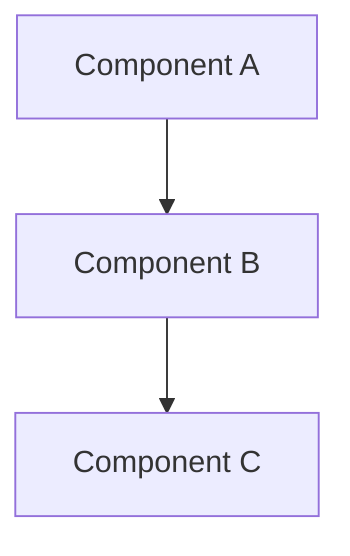

# PLAN-YYYYMMDD-NN: Plan Title

Last modified: YYYY-MM-DD
Status: Draft

## Objective

<!-- State what this plan achieves. Link to the specification(s) it
implements. -->

Implements SPEC-YYYYMMDD-NN.

## Related specifications and decisions

- SPEC-YYYYMMDD-NN: Specification name
- DEC-YYYYMMDD-NN: Decision name

## Current-state findings

<!-- Summarize relevant findings from the discovery phase. -->

- Finding 1
- Finding 2

## Intended shape

<!-- Describe the high-level approach: new components, modified components,
data model changes, interface changes. -->

## Work packages

### WP-01: Work package name

**Description:** Brief description.

**Tasks:**

- T-01: Task description (Expected)
- T-02: Task description (Required)

**Dependencies:** None.

**Parallelism:** Can run in parallel with WP-02.

### WP-02: Work package name

**Description:** Brief description.

**Tasks:**

- T-03: Task description (Discretion)

**Dependencies:** WP-01.

## Dependencies

- WP-02 depends on WP-01.

## Change map

| File | Action | Purpose |
| --- | --- | --- |
| `path/to/file.js` | Create | New component |
| `path/to/existing.js` | Modify | Add feature |

## Prescriptiveness levels

- **Required:** Must be implemented exactly as specified.
- **Expected:** Should be implemented as specified; deviation allowed with
  justification.
- **Discretion:** Suggested approach; implementer may choose differently.

## Scenario traceability matrix

| Scenario | Work package | Task | Test location |
| --- | --- | --- | --- |
| SCEN-001 | WP-01 | T-01 | `tests/unit/file.test.js` |
| SCEN-002 | WP-01 | T-02 | `tests/integration/file.test.js` |

## Documentation stubs

- [ ] Update DEC-YYYYMMDD-NN with implementation details.
- [ ] Create implementation map for new component.

## Verification criteria

- [ ] All scenarios implemented and tested.
- [ ] All documentation updated.
- [ ] `docs-check` passes.
- [ ] Lint and test suites pass.
